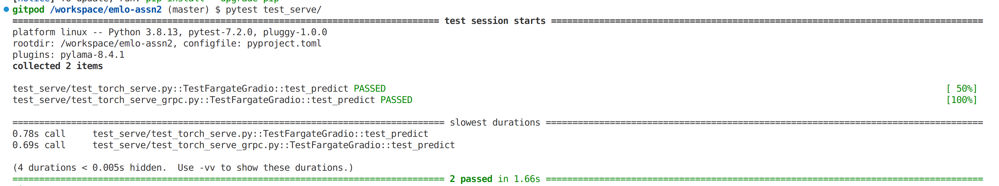
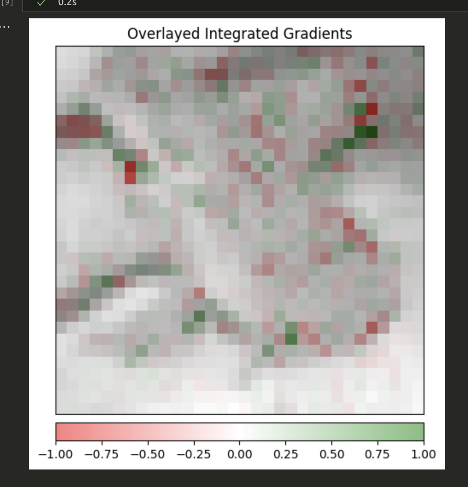
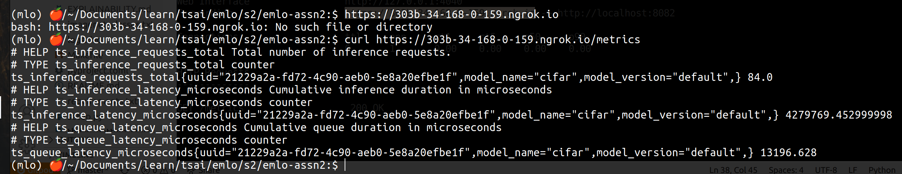
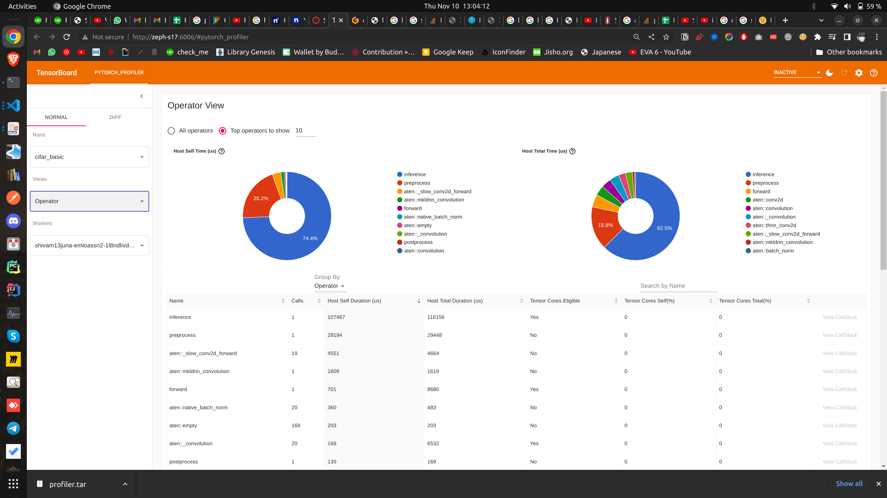
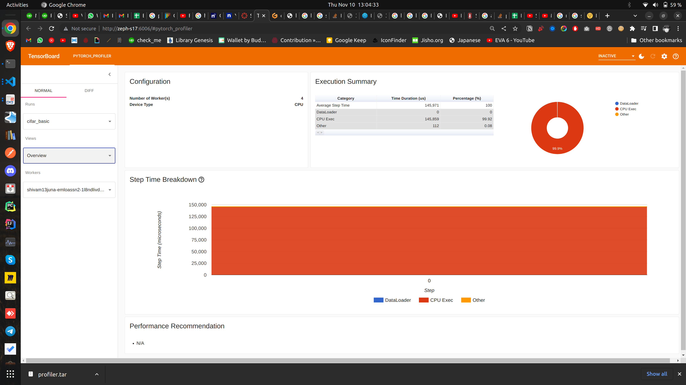

<!-- Create TORCHSERVE.md Links to an external site.file in your logbook
Copy/Paste output of pytest test_serve to it
Attach Model Explanation Image to it
Add Inference metrics (curl output of metrics api)
Upload Tensorboard Profiler to tensorboard.dev Links to an external site.and add link of it (this might not work, so instead just upload screenshots of the profiling page) -->

### 1. Output of pytest test_serve

### 2. Model Explanation Image

### 3. Inference metrics

### 4. Tensorboard Profiler

